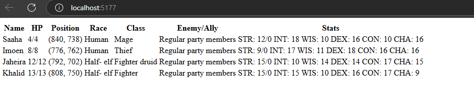

# Introduction

Baldur's Gate Process Displayer (bgpd) is an application to display live information about a current session of Baldur's Gate Enhanced Edition or Baldur's GateII  Enhanced Edition in a web-page.

# Download

Compiled downloads are not available.

# Compiling

To clone and run this application, you'll need [Git](https://git-scm.com) and [.NET](https://dotnet.microsoft.com/) installed on your computer. From your command line:

```
# Clone this repository
$ git clone https://github.com/btigi/bgpd

# Go into the repository
$ cd src

# Build  the app
$ dotnet build
```

# Usage

- Run bgpd.exe
- Visit http://localhost:5177/
- Start the game




# Licencing

bgpd is licenced under the MIT license. Full licence details are available in license.md

bgpd makes use of code from the [BG2RadarOverlay](https://github.com/tapahob/BG2RadarOverlay) application by tapahob.